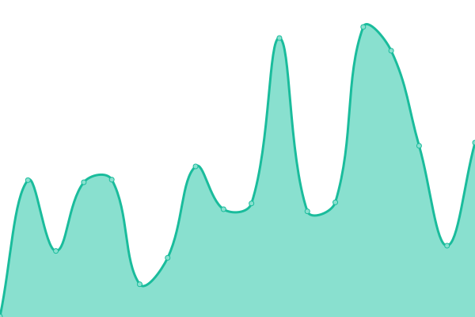
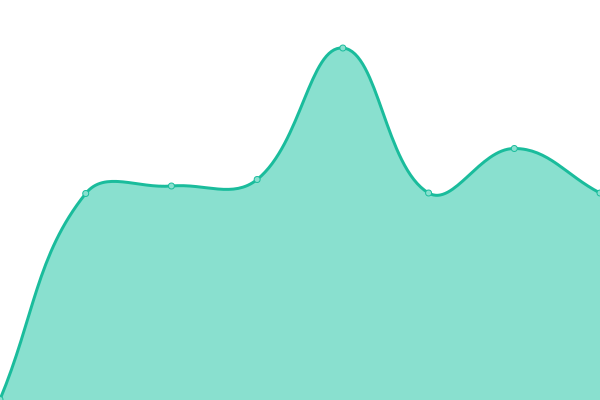
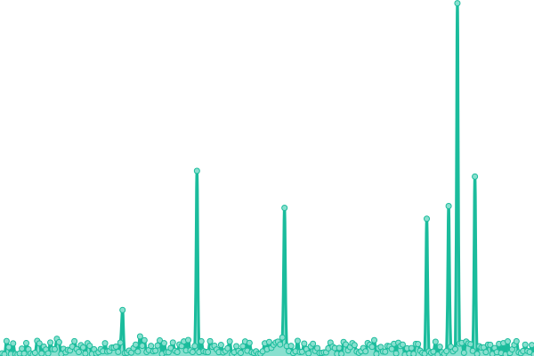

# [📈 Live Status](https://Fijxu.github.io/justlog-instances-uptime): <!--live status--> **🟧 Partial outage**

This repository contains the open-source uptime monitor and status page for [Fijxu](https://zzls.xyz), powered by [Upptime](https://github.com/upptime/upptime).

With [Upptime](https://upptime.js.org), you can get your own unlimited and free uptime monitor and status page, powered entirely by a GitHub repository. We use [Issues](https://github.com/Fijxu/justlog-instances-uptime/issues) as incident reports, [Actions](https://github.com/Fijxu/justlog-instances-uptime/actions) as uptime monitors, and [Pages](https://Fijxu.github.io/justlog-instances-uptime) for the status page.

<!--start: status pages-->
<!-- This summary is generated by Upptime (https://github.com/upptime/upptime) -->
<!-- Do not edit this manually, your changes will be overwritten -->
<!-- prettier-ignore -->
| URL | Status | History | Response Time | Uptime |
| --- | ------ | ------- | ------------- | ------ |
|  [logs.zzls.xyz](https://logs.zzls.xyz) | 🟩 Up | [logs-zzls-xyz.yml](https://github.com/Fijxu/justlog-instances-uptime/commits/HEAD/history/logs-zzls-xyz.yml) | 

 163ms
     
 | 

<a href="https://justloginstances.zzls.xyz/history/logs-zzls-xyz">97.38%</a>
    

|  [logs.ivr.fi](https://logs.ivr.fi) | 🟩 Up | [logs-ivr-fi.yml](https://github.com/Fijxu/justlog-instances-uptime/commits/HEAD/history/logs-ivr-fi.yml) | 

 566ms
     
 | 

<a href="https://justloginstances.zzls.xyz/history/logs-ivr-fi">100.00%</a>
    

|  [logs.zneix.eu](https://logs.zneix.eu/) | 🟥 Down | [logs-zneix-eu.yml](https://github.com/Fijxu/justlog-instances-uptime/commits/HEAD/history/logs-zneix-eu.yml) | 

 505ms
     
 | 

<a href="https://justloginstances.zzls.xyz/history/logs-zneix-eu">23.19%</a>
    

|  [justlog.kkx.one](https://justlog.kkx.one/) | 🟥 Down | [justlog-kkx-one.yml](https://github.com/Fijxu/justlog-instances-uptime/commits/HEAD/history/justlog-kkx-one.yml) | 

 1243ms
     
 | 

<a href="https://justloginstances.zzls.xyz/history/justlog-kkx-one">0.00%</a>
    

|  [logs.mmattbot.com](https://logs.mmattbot.com/) | 🟥 Down | [logs-mmattbot-com.yml](https://github.com/Fijxu/justlog-instances-uptime/commits/HEAD/history/logs-mmattbot-com.yml) | 

 207ms
     
 | 

<a href="https://justloginstances.zzls.xyz/history/logs-mmattbot-com">69.21%</a>
    

|  [logs.magichack.xyz](https://logs.magichack.xyz/) | 🟩 Up | [logs-magichack-xyz.yml](https://github.com/Fijxu/justlog-instances-uptime/commits/HEAD/history/logs-magichack-xyz.yml) | 

 178ms
     
 | 

<a href="https://justloginstances.zzls.xyz/history/logs-magichack-xyz">100.00%</a>
    

|  [logs.lucas19961.de](https://logs.lucas19961.de/) | 🟩 Up | [logs-lucas19961-de.yml](https://github.com/Fijxu/justlog-instances-uptime/commits/HEAD/history/logs-lucas19961-de.yml) | 

 586ms
     
 | 

<a href="https://justloginstances.zzls.xyz/history/logs-lucas19961-de">100.00%</a>
    

|  [logs.supa.codes](https://logs.supa.codes/) | 🟩 Up | [logs-supa-codes.yml](https://github.com/Fijxu/justlog-instances-uptime/commits/HEAD/history/logs-supa-codes.yml) | 

 470ms
     
 | 

<a href="https://justloginstances.zzls.xyz/history/logs-supa-codes">100.00%</a>
    

|  [vtlogs.moe](https://vtlogs.moe) | 🟩 Up | [vtlogs-moe.yml](https://github.com/Fijxu/justlog-instances-uptime/commits/HEAD/history/vtlogs-moe.yml) | 

 636ms
     
 | 

<a href="https://justloginstances.zzls.xyz/history/vtlogs-moe">100.00%</a>
    

|  [logs.spanix.team](https://logs.spanix.team/) | 🟩 Up | [logs-spanix-team.yml](https://github.com/Fijxu/justlog-instances-uptime/commits/HEAD/history/logs-spanix-team.yml) | 

 362ms
     
 | 

<a href="https://justloginstances.zzls.xyz/history/logs-spanix-team">97.39%</a>
    

|  [logs.2807.eu](https://logs.2807.eu/) | 🟩 Up | [logs-2807-eu.yml](https://github.com/Fijxu/justlog-instances-uptime/commits/HEAD/history/logs-2807-eu.yml) | 

 778ms
     
 | 

<a href="https://justloginstances.zzls.xyz/history/logs-2807-eu">100.00%</a>
    

|  [logs.jimmyboy.dev](https://logs.jimmyboy.dev/) | 🟩 Up | [logs-jimmyboy-dev.yml](https://github.com/Fijxu/justlog-instances-uptime/commits/HEAD/history/logs-jimmyboy-dev.yml) | 

 228ms
     
 | 

<a href="https://justloginstances.zzls.xyz/history/logs-jimmyboy-dev">100.00%</a>
    

<!--end: status pages-->

[**Visit our status website →**](https://Fijxu.github.io/justlog-instances-uptime)

## 📄 License

- Powered by: [Upptime](https://github.com/upptime/upptime)
- Code: [MIT](./LICENSE) © [Fijxu](https://zzls.xyz)
- Data in the `./history` directory: [Open Database License](https://opendatacommons.org/licenses/odbl/1-0/)
